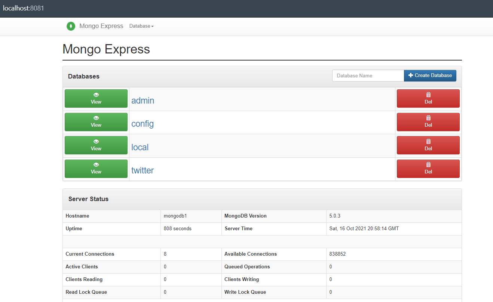

# Streaming twitter con kafka simple con producer y consumer con mongodb

Demo de streaming de tuits usando la api de Twitter y enviando los tuis a kafka y guardado en mongodb.

&nbsp;
## Requerimientos

* Docker

```
https://www.docker.com/get-started
```

* Acceso a la API de Twitter

Para generar la app developer y obtener las key

```url
https://developer.twitter.com/en/docs/twitter-api/getting-started/getting-access-to-the-twitter-api
```


* Git

```url
https://git-scm.com
```

* Instalar los requerimientos de python:
```
pip install -r requirements.txt
```

&nbsp;

## Ejecución

1. Clonar el repositorio

```
git clone https://github.com/ezeparziale/streaming-twitter-kafka-mongodb.git .
```

2. Ejecutar el archivo docker-compose.yaml

```
docker-compose -f "docker-compose.yaml" up -d
```

3. Configurar los parametros
   
Configurar el archivo **config.py**:  
* Setear la variable **TOPIC_NAME** con el valor del topico que queremos crear
```
TOPIC_NAME = 'twitter'
```

* Variables de busqueda:
```
TRACKS = ['#argentina','argentina','boca','river','ronaldo','messi','psg','barcelona','manchesterd']
LOCATION = [-126.2,-56.0,22.3,58.9]
LANGUAGES = ['en','es']
```

En el archivo **twitter_api.env** setear la claves de la api de twitter:
```
TWITTER_API_KEY = 'INGRESAR_LA_API_KEY'
TWITTER_API_SECRET_KEY = 'INGRESAR_LA_API_SECRET_KEY'
TWITTER_ACCESS_TOKEN = 'INGRESAR_EL_ACCESS_TOKEN'
TWITTER_ACCESS_TOKEN_SECRET = 'INGRESAR_EL_ACCESS_TOKEN_SECRET'
```

En el archivo **mongodb.env** setear la password de la base mongodb:
```
MONGO_INITDB_ROOT_USERNAME=root
MONGO_INITDB_ROOT_PASSWORD='INGRESE_PASSWORD'
ME_CONFIG_MONGODB_ADMINUSERNAME=root
ME_CONFIG_MONGODB_ADMINPASSWORD='INGRESE_PASSWORD'
```


4. Ejecutar el archivo **new_topic.py** para crear el topico en kafka.
   
5. Ejecutar el archivo **producer.py** para correr el producer de kafka y leer los tuits con los parametros establecidos y los va a disponibilizar en el topico.

6. Ejecutar el archivo **consumer_mongodb.py** para ir leyendo los datos del topico y guardarlos en la base mongodb.

7. Acceder a **mongo-express** para ver la base de datos y los registros guardados
```url
http://localhost:8081
```



## Extras

Algunas de las mejoras GUI para explorar mongodb
```url
https://retool.com/blog/the-best-mongodb-guis-in-2020/
```